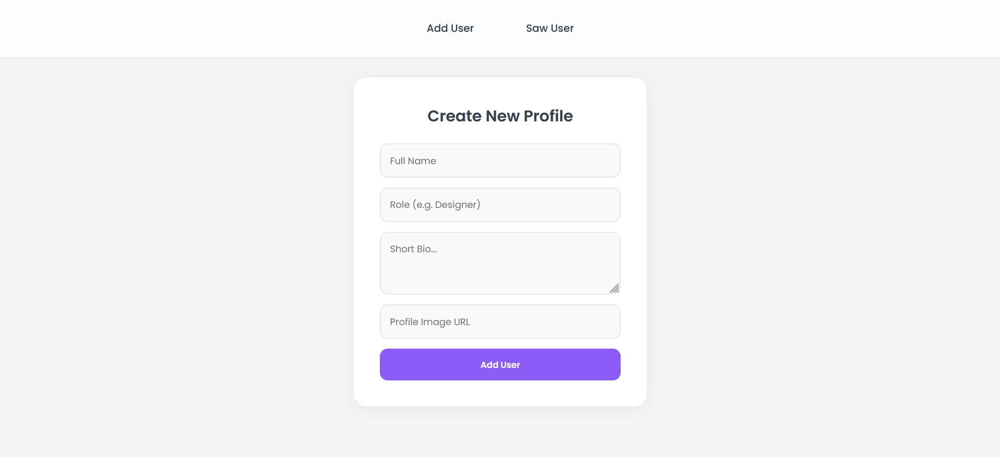
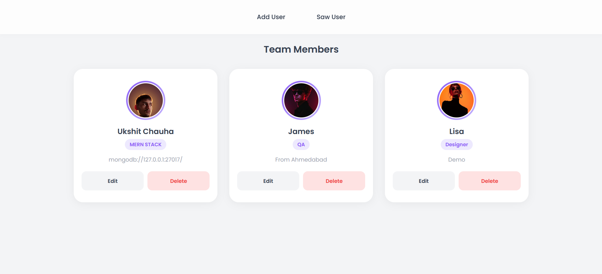

# User CRUD App (MERN Stack)

A **full-stack MERN (MongoDB, Express, Node.js, React + Vite)** application that provides a **RESTful API** to manage users.

The app allows you to **Add, View, Edit, and Delete users** using a clean React frontend that interacts with the backend API via **Axios**.

---


## Features

* Add new users ✅
* View all users ✅
* Edit user details ✅
* Delete users ✅
* Responsive frontend using React + Vite
* RESTful API with Express + MongoDB
* JSON-based request/response format
* Axios integration for frontend-backend communication

---

## Folder Structure

```
user-crud-app/
├── backend/
│   ├── config/
│   │   └── db.js
│   ├── controllers/
│   │   └── Crud.controllers.js
│   ├── models/
│   │   └── crud.model.js
│   ├── routes/
│   │   └── crud.routes.js
│   ├── utils/
│   ├── .env
│   ├── .gitignore
│   ├── package.json
│   └── server.js
├── frontend/
│   ├── public/
│   ├── src/
│   │   ├── assets/
│   │   ├── pages/
│   │   │   ├── AddUser.jsx
│   │   │   └── SawUser.jsx
│   │   ├── services/
│   │   │   └── API.js
│   │   ├── App.jsx
│   │   ├── App.css
│   │   └── index.css
│   ├── node_modules/
│   └── package.json
└── README.md
```

**Notes:**

* Backend `.gitignore` includes: `node_modules/`, `.env`
* Frontend `.gitignore` includes: `node_modules/`, `dist/` or `build/`

---

## Technologies Used

* **Backend:** Node.js, Express.js, MongoDB, Mongoose, dotenv, cors, nodemon
* **Frontend:** React.js, Vite, Axios, CSS

---

## Installation & Setup

### Backend

```bash
cd backend
npm install
```

Create a `.env` file with:

```
MONGO_URI=your_mongodb_connection_string
PORT=5000
```

Start backend server:

```bash
npx nodemon server.js
```

### Frontend

```bash
cd frontend
npm install
npm run dev
```

The frontend will run on `http://localhost:5173` and communicate with backend at `http://localhost:5000/`.

---

## API Endpoints

| Method | Route             | Description         | Request Body / Params             |
| ------ | ----------------- | ------------------- | --------------------------------- |
| POST   | `/addUser`        | Create a new user   | `{ name, role, bio, image }`      |
| GET    | `/allUser`        | Get all users       | None                              |
| PUT    | `/updateUser`     | Update user details | `{ _id, name, role, bio, image }` |
| DELETE | `/deleteUser/:id` | Delete user by ID   | `userId` in URL                   |

> Frontend Axios calls are located in `frontend/src/services/API.js`

---

## Usage

1. Start the backend (`npx nodemon server.js`)
2. Start the frontend (`npm run dev`)
3. Open `http://localhost:5173` in your browser
4. Use **Add User** page to create new profiles
5. Use **Saw User** page to view, edit, or delete users

---

## Screenshots

### Add User Page

](./screenshots/add_user.png)

### Saw User Page

](./screenshots/saw_user.png)

---

**Developed by:** Ukshit Chauhan
